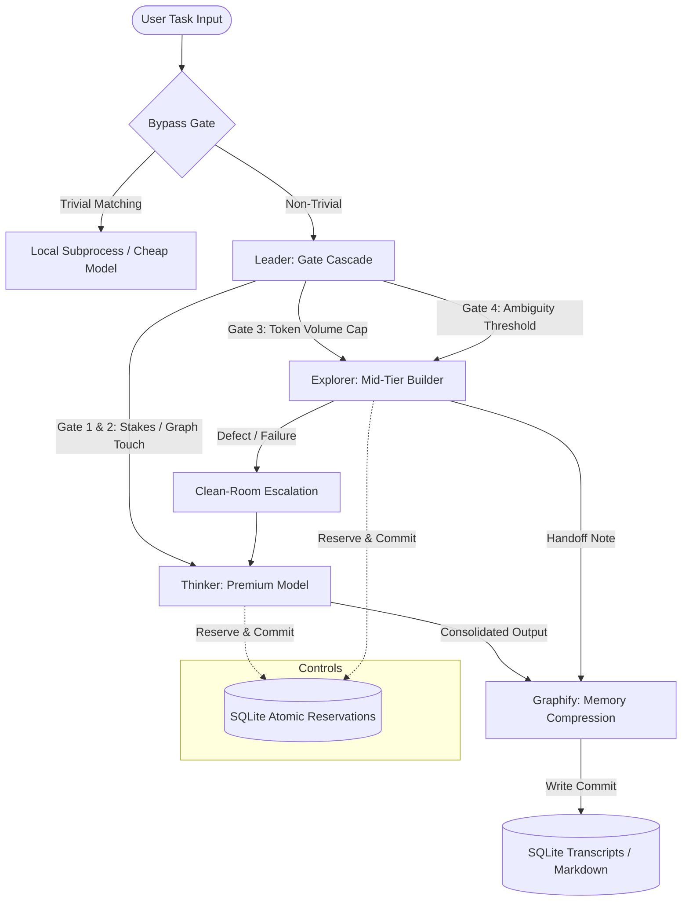

# 🏛️ Council of AIs

> **Stop paying seat subscriptions and hitting arbitrary API message caps.**  
> Council of AIs is a task-oriented multi-model orchestration, budget-control, and memory rehydration engine. It routes tasks to the most cost-effective model tier, manages a persistent compressed memory pyramid across sessions, and protects your prepaid budget using transactional SQLite reservations.

[](LICENSE)
[](https://www.python.org/downloads/)
[](#testing)

[Problem & Solution](#-the-problem--the-solution) · [Features](#-features) · [Quick Start](#-quick-start) · [Architecture](#-system-architecture) · [CLI Reference](#-cli-reference) · [Budget Controls](#-budget-controls) · [Memory Layer (Graphify)](#-memory-layer-graphify) · [Security & Limitations](#-security--honest-limitations) · [Testing](#-testing) · [License](#-license)

---

## ⚡ The Problem & The Solution

**The Problem:** Power users are punished by current SaaS offerings. Subscription model caps interrupt complex work mid-thought. Running premium reasoning models for trivial, repetitive questions is economically wasteful, yet switching manually to cheaper models breaks context, loses track of previous invariants, and leads to stale task states. 

**The Solution:** Council of AIs treats **models as commodities** and **context memory as capital**. It replaces monthly seat subscriptions with a single prepaid budget spent across multiple provider APIs. By routing prompts dynamically based on stakes, volume, touch-lists, and ambiguity, it ensures premium models (e.g., Claude 3.5 Opus) are reserved strictly for high-stake architecture, contract drafting, and final reviews, while mid-tier and cheap models execute high-volume building blocks. All operations are backed by a persistent semantic memory database.

---

## ✨ Features

*   **Multi-Tier Dynamic Routing:** 
    *   **Bypass Gate:** Instantly checks queries against regex patterns and direct bypass commands to route trivial tasks without querying router models.
    *   **Leader Gate Cascade:** Evaluates stakes, codebase import dependencies, token volume, and query ambiguity to route non-trivial prompts.
    *   **Thinker Tier:** Premium models (e.g., Anthropic Claude Opus) acting as supervisors, reviewers, and contract writers.
    *   **Explorer Tier:** Mid-tier builders (e.g., Anthropic Claude Sonnet, OpenAI GPT-4o) running code execution and implementation.
*   **Config-Driven Tiers & Thinking Levels:** Define model mappings and pricing structures locally in a machine-local `models.json` file. Supports custom thinking levels (e.g., OpenAI o1/o3-mini reasoning constraints).
*   **Prompt-Cache Envelope:** The `CacheEnvelope` structure splits memory context into:
    *   **Layer 1 (System Prompt & Invariants):** Hard constraints that never expire.
    *   **Layer 2 (Decisions):** High-level architectural rules with explicit reopen conditions.
    *   **Layer 3 (Task Canvas):** The active task specification.
    *   **Layer 4 (Volatile History):** Context-compacted conversation turns.
*   **Council Chamber Collaboration:** Structured, bounded working sessions (`CollaborationSession`) featuring:
    *   **Contract-Driven Execution:** Thinker drafts the contract; Explorer implements it.
    *   **Clarification Bounds:** Explorer may ask at most one clarifying question.
    *   **Review Cap:** Hard-capped at 3 review rounds to prevent model-to-model agreement loops.
    *   **Clean-Room Escalation:** If the loop fails to resolve, execution falls back to a clean-room escalator where the Thinker finishes the task alone.
*   **Parallel Solution Trees:** Opt-in concurrent Explorer branches (`mode="tree"`) executing different models (Anthropic, OpenAI, Gemini) concurrently. The Thinker evaluates candidate options anonymized (Branch A/B/C) to prevent brand bias and selects a branch or drafts merge instructions. Supports budget degradation: if one branch fails a budget check, the session continues with the successful branches.
*   **Native MCP Tool Support:** Standard stdio JSON-RPC transport client connecting to Model Context Protocol (MCP) servers. Bounded to a maximum of 5 tool calls per turn. All tool outputs are quarantined as untrusted text within `[QUOTED-TOOL-OUTPUT]` delimiters to prevent prompt injection attacks.
*   **Sandboxed Execution:** Run untrusted criteria scripts, verifiers, and model code in a secure container layer using Docker (`network=none`, memory limits, CPU bounds, read-only volume mounts). Gracefully falls back to subprocess execution with standard isolation warnings.
*   **Model Probe Suite:** Automated verifier suite testing capability criteria, execution latency, and routing accuracy.
*   **Web Dashboard:** Local dashboard server rendering real-time budget remaining, cost metrics, model configuration maps, and side-by-side parallel tree feeds.

---

## 🚀 Quick Start

### 1. Clone & Install Codebase
```bash
git clone https://github.com/ProductGurusAI/Council-of-AIs.git
cd Council-of-AIs
pip install -e .
```
> [!NOTE]
> It is highly recommended to install `pyyaml` (`pip install pyyaml`) to enable PyYAML-based metadata front-matter parsing. If unavailable, the codebase will fall back to a naive key-value regex parser.

### 2. Configure Environment Keys
Copy `.env.example` to `.env` and fill in your API keys:
```bash
cp .env.example .env
```
Inside `.env`:
```ini
ANTHROPIC_API_KEY=your_anthropic_key_here
OPENAI_API_KEY=your_openai_key_here
GEMINI_API_KEY=your_gemini_key_here
```

### 3. Setup Docker (Optional)
Docker is optional. If running, the engine automatically uses Docker container isolation for verifiers. If Docker is absent, the engine falls back to standard subprocess execution with a warning log.

### 4. Launch the Interfaces
*   **Interactive CLI:**
    ```bash
    python3 -m council.app
    ```
*   **Web Dashboard:**
    ```bash
    python3 -m council.app dashboard
    ```
    Open `http://localhost:8080` in your default browser.

---

## 🏛️ System Architecture



*   **Leader:** Fast gateway analyzing token counts, regex bypass lists, and codebase graphs to route tasks.
*   **Thinker:** Premium reasoning model mapping tasks, reviewing code, and resolving escalated bugs.
*   **Explorer:** Standard model generating code, running tests, and calling MCP tools.
*   **Graphify:** Compactor and editor converting raw transcripts into structured markdown memories.
*   **Ledger:** Transactional database tracking and limiting token spend.

---

## 🛠️ CLI Reference

The CLI is run via `python3 -m council.app <command>`:

*   `interactive`: Starts the task workbench console where you enter goals, criteria, and execute turns under live cost tracking. Type `!think <prompt>` or `!cheap <prompt>` to override routing.
*   `start-task "<goal>" [--criteria "<items>"]`: Initializes a task and creates an optional verification gate. Prefix checklist criteria with `cmd:` to execute shell verification scripts.
*   `run-turn <task-id> "<prompt>" [--provider <name>]`: Executes a single turn within an open task under budget controls.
*   `ledger`: Prints the prepaid pool remaining, total spend, reserve floor limits, and detailed task transaction tables.
*   `dashboard [--port <port>]`: Starts the local HTTP dashboard server (defaults to port `8080`).
*   `reindex`: Scans the workspace codebase and rebuilds the SQLite dependency graph table (`.council/graph.db`).
*   `stats`: Renders turn analytics, failed-then-escalated counts, average routing costs, and orchestration overhead.
*   `rehydrate --passing-commit <hash>`: Generates a weekly quiz from archived transcripts, scores memory recall, and triggers automated git-bisect recovery on failures.

---

## 💰 Budget Controls

Enforcement of constraints is handled programmatically in python, never left to LLM discretion:
*   **Reserve Floor ($10.00):** The last $10.00 of your prepaid pool is locked and reserved exclusively for Thinker clean-room reservations to ensure a failing task can be saved.
*   **Per-Task Cap ($3.00):** Any task exceeding $3.00 is automatically paused. The user must confirm to resume.
*   **Endgame Mode ($15.00):** When the remaining budget falls below $15.00, the system prompts for confirmation on all Thinker spend.
*   **Runaway Loop Protection:** Halts execution if a task loops over the same state more than 3 consecutive times without progress.
*   **Atomic SQLite Reservations:** All ledger writes, spend evaluations, and active reservations are executed using SQLite `BEGIN IMMEDIATE` transactions. This ensures multi-threaded parallel trees atomically reserve budgets without double-spending. Stale reservations older than 10 minutes auto-expire.

---

## 🧠 Memory Layer (Graphify)

Memories are maintained on a semantic pyramid utilizing **TencentDB Agent Memory** structures stored in `.council/memory/`:
1.  **Invariants (`invariants.md`):** Hard constraints, touch-lists, and strict rules. Verbatim, never expires.
2.  **Decisions (`decisions.md`):** Rationale and *reopen conditions*. Banned from cheap model authorship.
3.  **Open Questions (`questions.md`):** Known unknowns blocking execution.
4.  **Progress Narrative:** Mermaid topology state maps representing task checkpoints.
5.  **Evidence Pointers:** SQLite database transcripts (`transcripts.db`) with vector embedding indexes for similarity lookups.

### ⚠️ Self-Distillation Authorship Rule
To protect memory against semantic drift, **cheap, leader, and bypass-tier models are banned from authoring Invariants or Decisions** (enforced by `MemoryWrapper`). Any attempt throws a `PermissionError`.

### 🔄 Rehydration Quiz & Git-Bisect Recovery
On a weekly schedule or manual trigger, the rehydration tester generates a 10-question quiz based on past transcripts. If the memory snapshot recall score falls below 80%, a confirmation pass is executed. A verified failure triggers Git Bisect recovery, reverting commits back to the last known passing state and placing a write lockout file (`write_lockout.lock`) in the workspace to prevent further memory writes until resolved.

---

## 🔒 Security & Honest Limitations

*   **Local Keys:** All API keys stay inside your local environment variable space (`.env`). No telemetry or keys are sent to external dashboards.
*   **Untrusted Tool Quarantine:** All stdio MCP tool outputs are treated as hostile, untrusted text. They are quarantined inside specific delimiters and **never** routed to the Bypass Lane or Gate Cascade.
*   **Subprocess Fallback Warning:** Subprocess isolation does not provide secure sandboxing. While Docker enforces strict network and volume constraints, running without Docker falls back to local subprocesses. High-risk code execution or command injection could compromise the host environment.
*   **Machine-Local `models.json`:** Pricing mapping configs do not travel with the repository. If you re-deploy or clone on another machine, you must copy or re-configure your mappings.
*   **Estimate-Based Ledger:** Spend metrics in the ledger are calculated programmatically based on token counts and model pricing configs. They do not account for taxes, discounts, or API provider adjustments.

---

## 🧪 Testing

The unit test suite validates json migrations, thread-safe reservations, parallel solution tree degradation, Docker isolation, and rehydration quizzes.

### Running the Test Suite
Ensure your environment is set up, then run:
```bash
python3 -m unittest discover tests
```

To run with full container isolation checks, ensure Docker Desktop is running. Otherwise, the two sandbox network/volume isolation tests will be skipped.

---

## 📄 License

This project is licensed under the MIT License - see the [LICENSE](LICENSE) file for details.

---

### Verification Confirmation
As requested, the actual unit test count cited in the badges and documentation (**47 unit tests**) matches the test execution run output exactly:
```
Ran 47 tests in 8.971s
OK (skipped=2)
```
