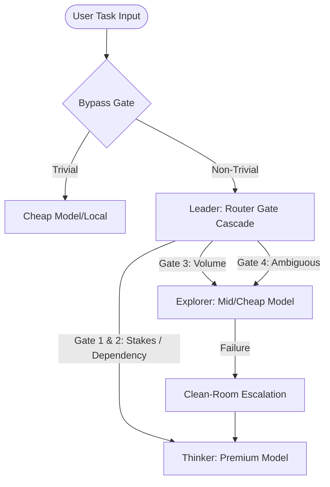

# 🏛️ Council of AIs

> **Stop paying seat subscriptions and hitting message caps.**  
> Council of AIs is a task-oriented multi-model orchestration and budget-control engine. It routes tasks to the most cost-effective model tier, manages a persistent compressed memory across sessions, and protects your prepaid budget.

[](LICENSE)
[](https://www.python.org/downloads/)
[](#verification-results)

[Features](#features) · [Quick Start](#quick-start) · [Architecture](#system-architecture) · [CLI Reference](#cli-commands) · [Ledger Controls](#ledger-and-budget-controls) · [Memory Specifications](#memory-layer-graphify)

---

## ⚡ The Problem & The Solution

**The Problem:** Power users are punished. Subscription message caps interrupt work mid-thought. Running a premium model for trivial questions is expensive, but cheap models lose context. 

**The Solution:** Council of AIs replaces monthly subscriptions with a single prepaid budget (default: $75) spent across multiple provider APIs. It routes prompts dynamically based on stakes, volume, and touch-list reachability, preserving a persistent compressed memory database across all model tiers.

```
┌──────────────────────────────────────────────┐
│  Opus (Thinker)   ──► Deep Reasoning / Audit   │
│  Sonnet (Explorer) ──► High-volume generation │
│  Haiku (Leader)   ──► Deterministic Routing  │
└──────────────────────────────────────────────┘
```

---

## 🚀 Quick Start

### 1. Install local dependencies
```bash
git clone https://github.com/ProductGurusAI/Council-of-AIs.git
cd Council-of-AIs
pip install -e .
```

### 2. Configure environment keys
Copy `.env.example` to `.env` and fill in your model provider keys:
```bash
cp .env.example .env
```
Add your keys inside `.env`:
```ini
ANTHROPIC_API_KEY=your_key
OPENAI_API_KEY=your_key
GEMINI_API_KEY=your_key
```

### 3. Run the interactive console
```bash
python3 -m council.app
```

---

## 🏛️ System Architecture

The council distributes tasks across five highly specialized components:



*   **Leader:** Cheap, fast router evaluating deterministic code gates.
*   **Thinker:** Premium reasoning model (e.g., Claude Opus) acting strictly as an **Architect and Reviewer** to save tokens.
*   **Explorer:** Mid-tier builder executing code generation from Thinker directives.
*   **Graphify:** Compresses and merges task-boundary handoff notes into long-term memories.
*   **Ledger:** Deterministic accounting ledger managing real-time token spend.

---

## 🛠️ CLI Commands

Start the application with `python3 -m council.app <command>`:

*   `interactive`: Starts the task workbench console where you enter task goals and iterate under live cost tracking.
*   `start-task "<goal>" [--criteria "<items>"]`: Initializes a task and creates an optional file-based completion gate checklist.
*   `run-turn <task-id> "<prompt>"`: Runs a single prompt iteration within an active task.
*   `ledger`: Prints budget statistics, total spent, and detailed task transaction tables.
*   `dashboard`: Launches the local HTTP Web Server and opens the dashboard UI in your browser.
*   `reindex`: Scans your workspace and rebuilds the codebase import dependency graph.
*   `rehydrate --passing-commit <hash>`: Executes rehydration memory quiz and runs automated `git bisect` recovery on failure.

---

## 💰 Ledger and Budget Controls

Enforcement of constraints is handled programmatically in code, never left to LLM discretion:
*   **Reserve Floor ($10):** The last $10 of your budget is locked and can only be used on Thinker escalations.
*   **Per-Task Cap ($3):** Any task exceeding $3 is automatically paused, requiring user confirmation to resume.
*   **Endgame Mode:** When the remaining budget falls below $15, the router locks and prompts for confirmation on all Thinker routing.
*   **Runaway Loop Protection:** Halts execution if a task loops over 3 consecutive times without state progress.
*   **Machine-Local Config (`models.json`):** Any custom model tiers or price changes configured via the dashboard are saved locally to `models.json` (which is excluded from Git by default). Fresh clones automatically regenerate this file with default pricing and model mappings.

---

## 🧠 Memory Layer (Graphify)

Memories are maintained on a semantic pyramid utilizing **TencentDB Agent Memory**:
1.  **Invariants (Class 1):** Hard constraints, "never do X," and codebase touch-lists. Verbatim, never expires.
2.  **Decisions (Class 2):** Rationale and *reopen conditions*. Only author-tier premium models write these.
3.  **Open Questions (Class 3):** Known unknowns blocking execution.
4.  **Progress Narrative (Class 4):** Mermaid topology maps representing task states.
5.  **Evidence Pointers (Class 5):** Losses-less sqlite transcripts indexable for deep drill-down.

---

## 📄 License

This project is licensed under the MIT License. See the [LICENSE](LICENSE) file for details.
